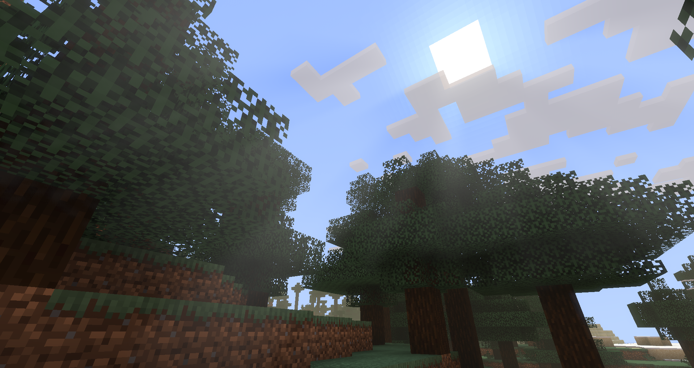
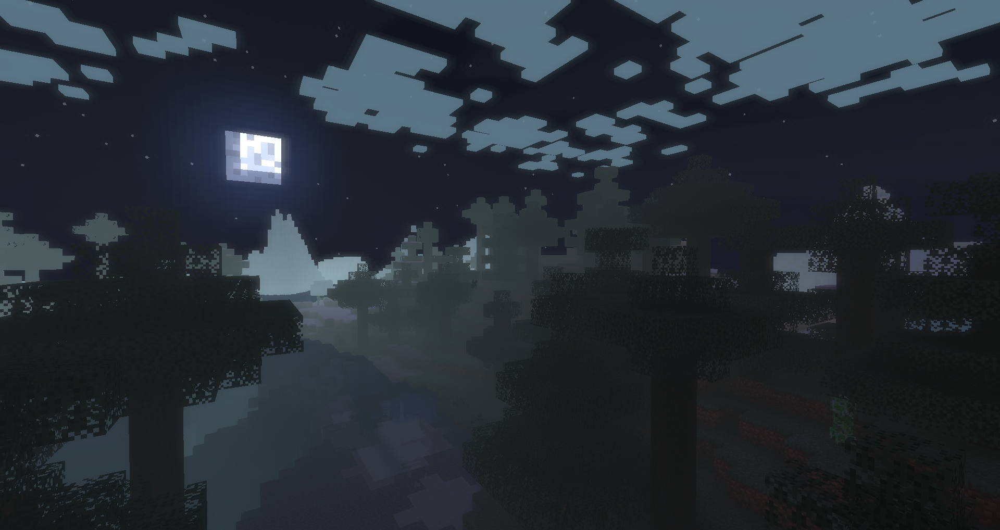
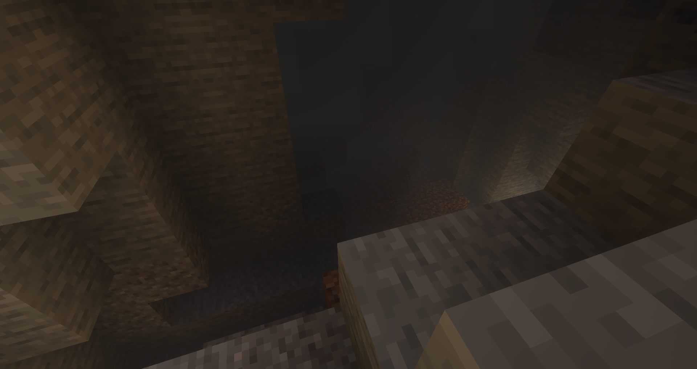

Base template made by Bálint.

This pack focuses on the original minecraft aesthetics while adding some nice lighting and more life to the game. 

**WIP: pack is not finished!**

Colored light library from:
https://github.com/eclipseisoffline/iris-coloured-lights

Radial blur for god rays referenced from:
https://www.shadertoy.com/view/XsfSDs

Gaussian blur referenced from:
https://www.shadertoy.com/view/Xltfzj

World Space Raytracing routine by Boduru:
https://github.com/MahoganyTown/Minecraft-Shader-SSR
